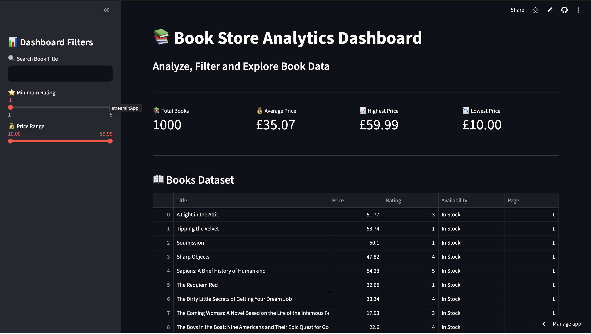

# 📚 Book Store Analytics Dashboard


A professional web scraping and analytics project built using Python, BeautifulSoup, Pandas, Matplotlib, and Streamlit.

The application scrapes book information from an online bookstore, processes the data, and displays interactive analytics through a modern dashboard.

---

## 🚀 Live Demo

👉 Add your Streamlit URL here

```text
https://your-streamlit-app-url.streamlit.app
```

---

## 📸 Dashboard Preview


---

## ✨ Features

### 📥 Data Scraping
- Scrapes 1000+ books
- Extracts:
  - Book Title
  - Price
  - Rating
  - Availability
  - Page Number

### 📊 Data Analysis
- Average Book Price
- Highest Price
- Lowest Price
- Rating Analysis
- Price Distribution

### 🎯 Dashboard Features
- Search Books
- Rating Filter
- Price Range Filter
- Interactive Data Table
- Download CSV
- Visual Analytics
- Summary Statistics

---

## 🛠️ Tech Stack

| Technology | Purpose |
|------------|----------|
| Python | Programming Language |
| Requests | Fetch Web Pages |
| BeautifulSoup | Web Scraping |
| Pandas | Data Processing |
| Matplotlib | Data Visualization |
| Streamlit | Dashboard |
| Git & GitHub | Version Control |

---

## 📂 Project Structure

```bash
book-store-analytics-dashboard
│
├── app.py
├── scraper.py
├── products.csv
├── requirements.txt
├── README.md
└── screenshots/
```

---

## ⚙️ Installation

### Clone Repository

```bash
git clone https://github.com/HarshaThummala4545/book-store-analytics-dashboard.git
cd book-store-analytics-dashboard
```

### Create Virtual Environment

```bash
python -m venv venv
```

### Activate Environment

Mac/Linux

```bash
source venv/bin/activate
```

Windows

```bash
venv\Scripts\activate
```

### Install Dependencies

```bash
pip install -r requirements.txt
```

---

## ▶️ Run Scraper

```bash
python scraper.py
```

---

## ▶️ Run Dashboard

```bash
streamlit run app.py
```

Open:

```text
http://localhost:8501
```

---

## 📈 Analytics Included

- Total Books
- Average Price
- Highest Price
- Lowest Price
- Price Distribution
- Rating Distribution
- Top Rated Books
- Most Expensive Books
- Downloadable CSV Reports

---

## 🎯 Learning Outcomes

Through this project I learned:

- Web Scraping
- Data Cleaning
- Data Analysis
- Data Visualization
- Dashboard Development
- Git & GitHub Workflow
- Python Project Structuring

---

## 👨‍💻 Author

### Harsha Sri Sai Thummala

🔗 GitHub:
https://github.com/HarshaThummala4545

🔗 LinkedIn:
https://www.linkedin.com/in/harshathummala

📧 Email:
harshasai.thummala@gmail.com

---

## ⭐ Support

If you found this project useful, please consider giving it a ⭐ on GitHub.
